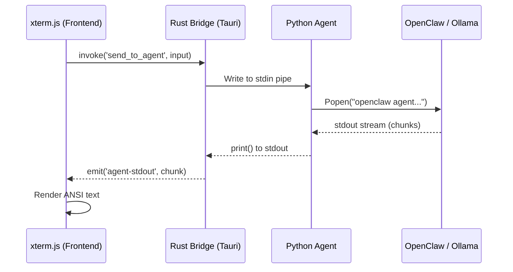

<div align="center">


# 🏛️ Aether — Architecture Guide

*How the neural workstation is built and why.*

</div>

---

::: warning ALPHA NOTICE
**Aether is currently in Alpha.** Public binary releases are not yet available. Please follow the instructions in the [GitHub Repository](https://github.com/earnerbaymalay/aether-tauri) to build from source.
:::

## 📐 Ecosystem Vision

<div align="center">
  
</div>

Aether is designed as a **modular, self-healing neural ecosystem**. It prioritizes local execution, data sovereignty, and zero-latency interaction.

---

## 🌌 System Overview

Aether is a **three-layer system**:

```
┌────────────────────────────────────────────────────────────────┐
│                     LAYER 1: PRESENTATION                      │
│            Tauri WebView (TypeScript + xterm.js)               │
│     index.html · src/main.ts · src/styles/app.css              │
└────────────────────────────┬───────────────────────────────────┘
                             │  Tauri invoke() / event stream
┌────────────────────────────▼───────────────────────────────────┐
│                      LAYER 2: NATIVE BRIDGE                    │
│                   Rust / Tauri Backend                         │
│        get_system_info · start_agent · send_to_agent           │
│        run_benchmark · run_nexus_optimization                  │
└────────────────────────────┬───────────────────────────────────┘
                             │  subprocess / stdin-stdout pipe
┌────────────────────────────▼───────────────────────────────────┐
│                      LAYER 3: AGENT CORE                       │
│                   Python 3.10+ Runtime                         │
│   aether_agent.py → OpenClaw CLI → Ollama → MCP Servers        │
│   AetherVault · AetherLink · AetherFS · Nexus Shield           │
└────────────────────────────────────────────────────────────────┘
```

::: info ARCHITECTURAL PRINCIPLES
- **Decoupled Frontend:** The frontend never talks directly to Ollama. All inference is mediated by the Rust bridge and Python agent.
- **Standalone Core:** The agent is fully standalone. `aether.sh` launches the same Python agent that the Tauri backend spawns — useful for headless operation.
- **Pluggable Bridge:** Switching inference backends (Ollama, LM Studio, llama.cpp) only requires changes in the agent's completion stream logic.
:::

---

## 🗂️ Layer Breakdown

### Layer 1 — Presentation (TypeScript + xterm.js)

The frontend is a single-page application (SPA) built with vanilla TypeScript to keep the bundle size small and the performance high.

| File | Responsibility |
| :--- | :--- |
| `index.html` | Application shell: header, pathway selector, xterm container, system panel, Nexus overlay |
| `src/main.ts` | Event handling, Tauri IPC calls, xterm.js terminal lifecycle, tier selection |
| `src/styles/app.css` | Full design system: CSS custom properties, component styles, animations |

::: details Key Design Decisions
- **xterm.js** is used for terminal rendering to support ANSI escape sequences from the Rich-powered Python agent. This provides a true terminal experience with support for colors, progress bars, and complex layouts.
- **Pathway cards** provide a visual gateway to different AI models. While the UI makes them look like distinct modes, they primarily change the `active_model` and system instructions passed to the agent.
- **Reactive Streaming:** The frontend listens for `agent-stdout` and `agent-stderr` events from the Rust backend, ensuring that AI responses appear instantly without waiting for the full buffer.
:::

### Layer 2 — Native Bridge (Rust / Tauri)

The Tauri backend acts as a high-performance bridge between the web frontend and the system-level Python process.

| Command | Signature | Description |
| :--- | :--- | :--- |
| `get_system_info` | `() → SystemInfo` | Platform, OS, arch, RAM, dependency detection |
| `start_agent` | `() → ()` | Spawns `aether_agent.py` as a child process, wires stdout/stderr to events |
| `send_to_agent` | `(input: string) → ()` | Writes to the agent's stdin pipe |
| `run_benchmark` | `(args: BenchmarkArgs) → BenchmarkResult` | Runs llama-cli benchmark on a specified model |

::: tip WHY RUST?
Rust provides the safety and speed required to manage long-running subprocesses and high-frequency event streaming. By using Tauri, we avoid the overhead of a full Chromium process for the backend, resulting in much lower RAM usage than Electron.
:::

### Layer 3 — Agent Core (Python)

The "Brain" of Aether. The Python agent orchestrates the interaction between the user, the LLM, and the local file system.

1. **Input Dispatch:** Routes slash commands to local Python functions or forwards text to the LLM.
2. **Bridge Integration:** Uses the OpenClaw CLI to communicate with Ollama and MCP servers.
3. **Shadow Distillation:** A background thread that summarizes conversations into the AetherVault without slowing down the main interaction.

---

## 🔄 Data Flow Diagram

### Standard Inference Request



---

## 🚀 Performance & Latency

Aether is optimized for **Zero-Latency Feel**.

- **Rust/Python Bridge:** We use standard `stdin`/`stdout` pipes for communication. This avoids the overhead of HTTP or WebSocket handshakes for every message.
- **Async Shadowing:** Memory distillation (saving to AetherVault) happens in a separate Python thread. The user receives their answer immediately, and the "learning" happens in the background.
- **Streaming by Default:** Every layer of the stack (Ollama -> OpenClaw -> Python -> Rust -> TypeScript) supports streaming. You see the first token in milliseconds.

| Metric | Target |
| :--- | :--- |
| **First Token Latency** | < 200ms (on 8GB RAM) |
| **Idle RAM Usage** | < 150MB |
| **Vault Indexing** | < 1s per 100 fragments |

---

## 🐍 Agent Core Modules

### `aether_agent.py` — Main Entry Point
The orchestration layer. Owns the primary `chat_loop()`, slash command handlers, and UI state management.

### `mcp_client.py` — MCP Server Manager
Manages the lifecycle of Model Context Protocol servers. It spawns servers via `npx` and makes their tools available for the LLM to use.

### `p2p_sync.py` — AetherLink
Implements an encrypted peer-to-peer listener for synchronizing vault fragments between different Aether instances on your local network.

---

## 🎨 Frontend Design System

The entire UI is driven by CSS custom properties defined in `src/styles/app.css`, mirroring a "Neural Cyberpunk" aesthetic based on GitHub Dark themes.

### Color Palette

| Token | Value | Usage |
| :--- | :--- | :--- |
| `--bg` | `#0d1117` | Application background |
| `--teal` | `#58a6ff` | Primary accent, xterm cursor |
| `--purple` | `#bc8cff` | Nexus Shield accent |
| `--red` | `#ff7b72` | Error states |

---

## 🔒 Security Model

| Concern | Mitigation |
| :--- | :--- |
| **Destructive Commands** | `run_tool()` blocks calls containing `rm -rf` |
| **Data Sovereignty** | All inference is local; no API keys or telemetry |
| **Process Isolation** | The Python agent runs as a restricted child process |
| **Tauri Security** | Strict CSP and command allowlisting |
